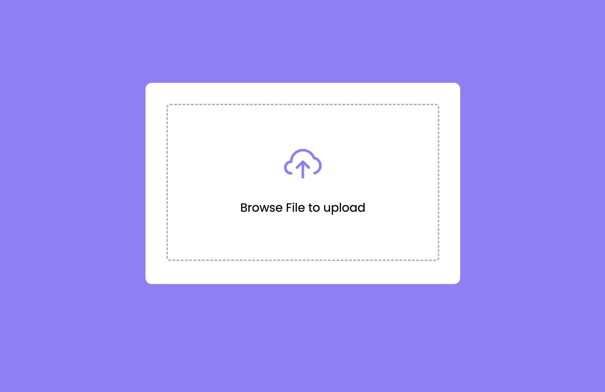
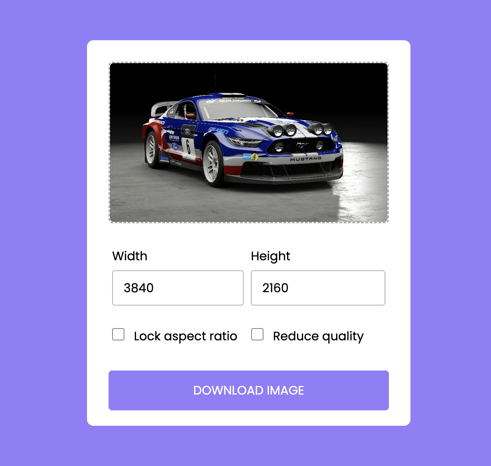

<h1>Descripcion</h1>
This project was built in pure javascript, the application is for resizing uploaded images.

<h2>Screen to upload an image to resize</h2>

<h2>Screen to configure the size of an image</h2>

